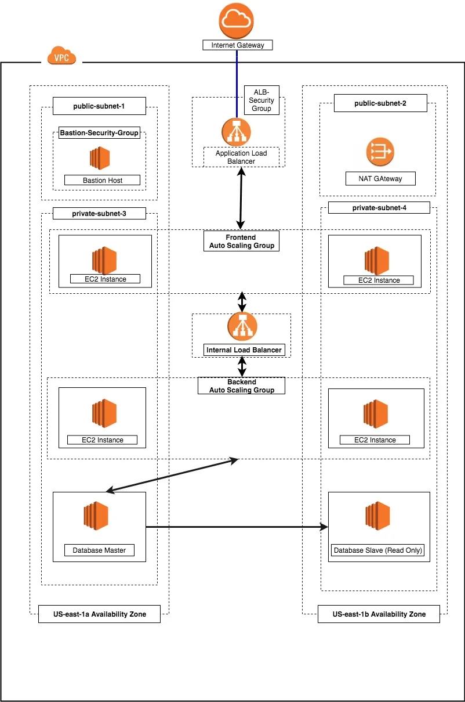
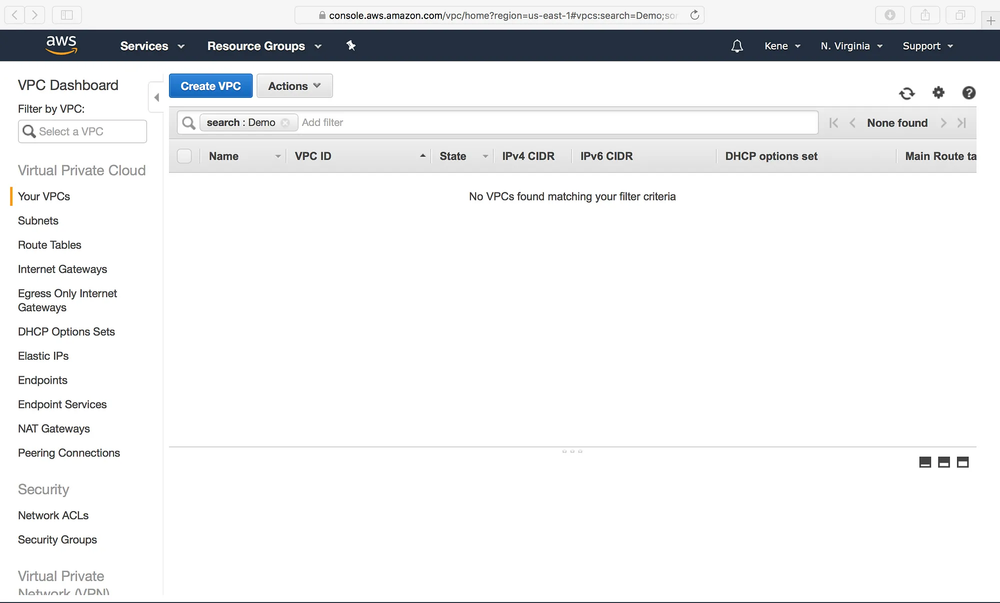
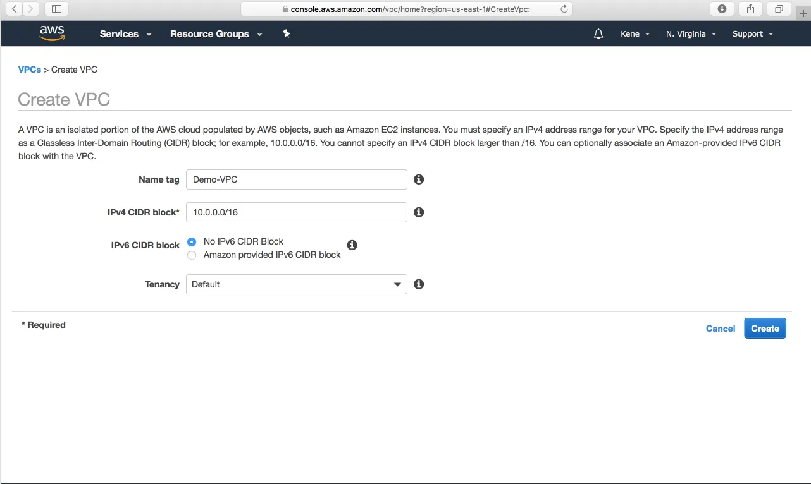
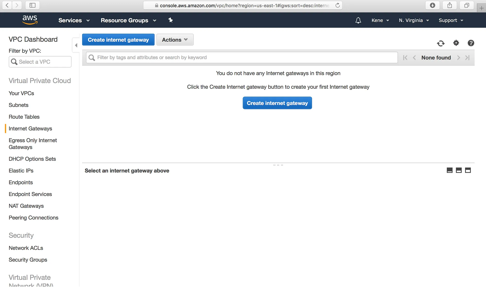
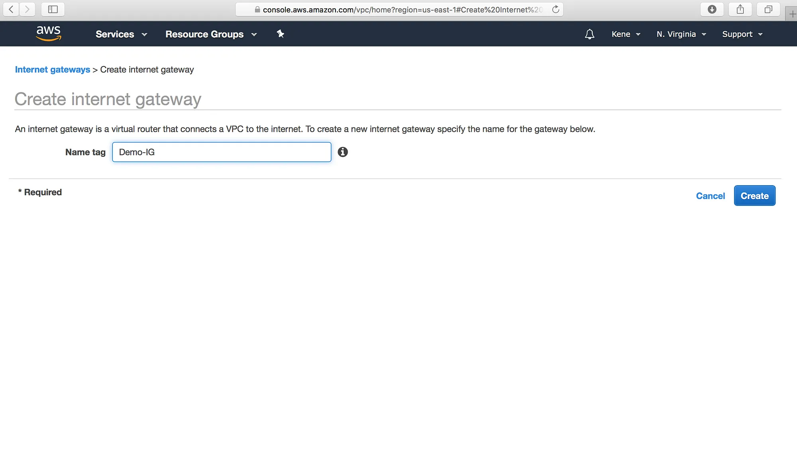
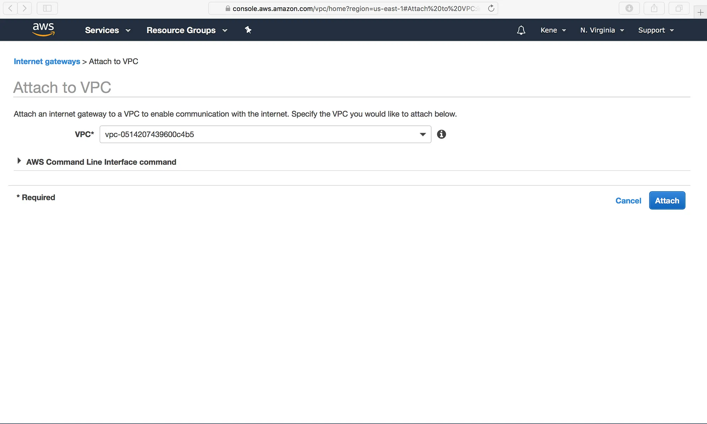

Design an architecture diagram for a 3 Tier web application:
------------------------------------------------------------

* A three-tier architecture is a software architecture pattern where the application is broken down into three logical tiers: the presentation layer, the business logic layer and the data storage layer.
* This architecture is used in a client-server application such as a web application that has the frontend, the backend and the database.
* This a shift from the monolithic way of building an application where the frontend, the backend and the database are both sitting in one place.
* we shall be making use of the following AWS services to design and build a three-tier cloud infrastructure: Elastic Compute Cloud (EC2), Auto Scaling Group, Virtual Private Cloud(VPC), Elastic Load Balancer (ELB), Security Groups and the Internet Gateway. Our infrastructure will be designed to be highly available and fault tolerant.

* We are using the 3 tier architecture for 
  1. Modularity: The essence of having a three-tier architecture is to modularize our application such that each part can be managed independently of each other.
  2. Scalability: Each tier of the architecture can scale horizontally to support the traffic and request demand coming to it. This can easily be done by adding more EC2 instances to each tier and load balancing across them.
  3. High Availability: With the traditional data centre, our application is sitting in one geographical location. If there is an earthquake, flooding or even power outage in that location where our application is hosted, our application will not be available. 
  4. Fault Tolerant: We want our infrastructure to comfortably adapt to any unexpected change both to traffic and fault.So instead of having two EC2 instances working at 50% each, such that when one instance goes bad, the other instance will be working at 100% capacity until a new instance is brought up by our Auto Scaling Group, we have extra instance making it three instances working at approximately 35% each. This is usually a tradeoff made against the cost of setting up a redundant system.
  5. Security: We want to design an infrastructure that is highly secured and protected from the prying eyes of hackers. As much as possible, we want to avoid exposing our interactions within the application over the internet. This simply means that the application will communicate within themselves with a private IP. The presentation (frontend) tier of the infrastructure will be in a private subnet (the subnet with no public IP assigned to its instances) within the VPC. Users can only reach the frontend through the application load balancer.
* The following steps are to be implemented while creating a 3-tier architecture in AWS.
  1. Setup the Virtual Private Cloud (VPC): VPC stands for Virtual Private Cloud (VPC). It is a virtual network where you create and manage your AWS resource in a more secure and scalable manner.Give your VPC a name and a CIDR block of 10.0.0.0/16.
   
   
  2. Setup the Internet Gateway: The Internet Gateway allows communication between the EC2 instances in the VPC and the internet.
   
   
  3. We need to attach our VPC to the internet gateway. To do that:
     a. we select the internet gateway.
     b. Click on the Actions button and then select Attach to VPC.
     c. Select the VPC to attach the internet gateway and click Attach.
   
