Design an architecture diagram for a 3 Tier web application:
------------------------------------------------------------

* A three-tier architecture is a software architecture pattern where the application is broken down into three logical tiers: the presentation layer, the business logic layer and the data storage layer.
* This architecture is used in a client-server application such as a web application that has the frontend, the backend and the database.
* This a shift from the monolithic way of building an application where the frontend, the backend and the database are both sitting in one place.
* we shall be making use of the following AWS services to design and build a three-tier cloud infrastructure: Elastic Compute Cloud (EC2), Auto Scaling Group, Virtual Private Cloud(VPC), Elastic Load Balancer (ELB), Security Groups and the Internet Gateway. Our infrastructure will be designed to be highly available and fault tolerant.

* We are using the 3 tier architecture for 
  1. Modularity: The essence of having a three-tier architecture is to modularize our application such that each part can be managed independently of each other.
  2. Scalability: Each tier of the architecture can scale horizontally to support the traffic and request demand coming to it. This can easily be done by adding more EC2 instances to each tier and load balancing across them.
  3. High Availability: With the traditional data centre, our application is sitting in one geographical location. If there is an earthquake, flooding or even power outage in that location where our application is hosted, our application will not be available. 
  4. Fault Tolerant: We want our infrastructure to comfortably adapt to any unexpected change both to traffic and fault.So instead of having two EC2 instances working at 50% each, such that when one instance goes bad, the other instance will be working at 100% capacity until a new instance is brought up by our Auto Scaling Group, we have extra instance making it three instances working at approximately 35% each. This is usually a tradeoff made against the cost of setting up a redundant system.
  5. Security: We want to design an infrastructure that is highly secured and protected from the prying eyes of hackers. As much as possible, we want to avoid exposing our interactions within the application over the internet. This simply means that the application will communicate within themselves with a private IP. The presentation (frontend) tier of the infrastructure will be in a private subnet (the subnet with no public IP assigned to its instances) within the VPC. Users can only reach the frontend through the application load balancer.
* The following steps are to be implemented while creating a 3-tier architecture in AWS.
  1. Setup the Virtual Private Cloud (VPC): VPC stands for Virtual Private Cloud (VPC). It is a virtual network where you create and manage your AWS resource in a more secure and scalable manner.Give your VPC a name and a CIDR block of 10.0.0.0/16.
   
   
  2. Setup the Internet Gateway: The Internet Gateway allows communication between the EC2 instances in the VPC and the internet.
   
   
  3. We need to attach our VPC to the internet gateway. To do that:
     a. we select the internet gateway.
     b. Click on the Actions button and then select Attach to VPC.
     c. Select the VPC to attach the internet gateway and click Attach.
   
  4. Create 4 Subnets: The subnet is a way for us to group our resources within the VPC with their IP range. A subnet can be public or private. EC2 instances within a public subnet have public IPs and can directly access the internet while those in the private subnet does not have public IPs and can only access the internet through a NAT gateway.
  For our setup, we shall be creating the following subnets with the corresponding IP ranges.
   * demo-public-subnet-1 | CIDR (10.0.1.0/24) | Availability Zone (us-east-1a)
   * demo-public-subnet-2 | CIDR (10.0.2.0/24) | Availability Zone (us-east-1b)
   * demo-private-subnet-3 | CIDR (10.0.3.0/24) | Availability Zone (us-east-1a)
   * demo-private-subnet-4 | CIDR(10.0.4.0/24) | Availability Zone (us-east-1b)
   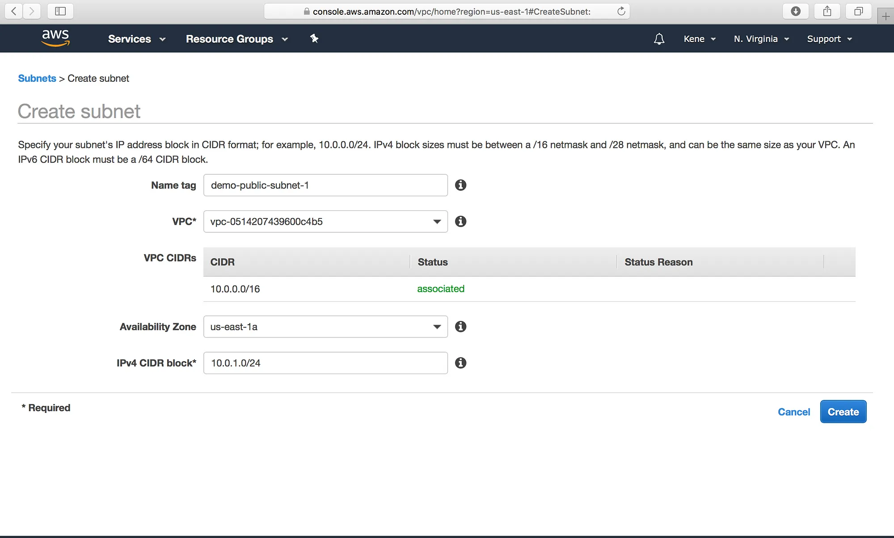
   
   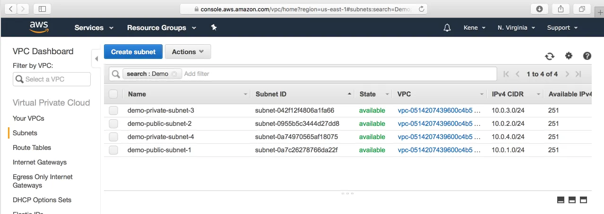
  5. Create Two Route Tables: Route tables is a set of rule that determines how data moves within our network. We need two route tables; private route table and public route table. The public route table will define which subnets that will have direct access to the internet ( ie public subnets) while the private route table will define which subnet goes through the NAT gateway (ie private subnet). 
    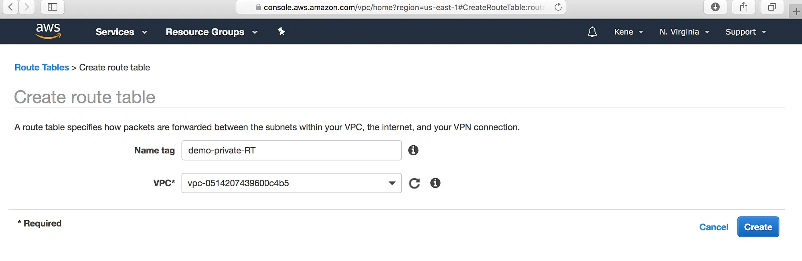
    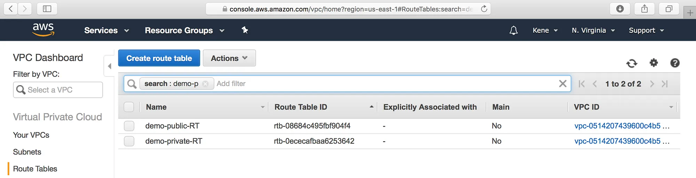
  6. The public and the private subnet needs to be associated with the public and the private route table respectively.To do that, we select the route table and then choose the Subnet Association tab.
    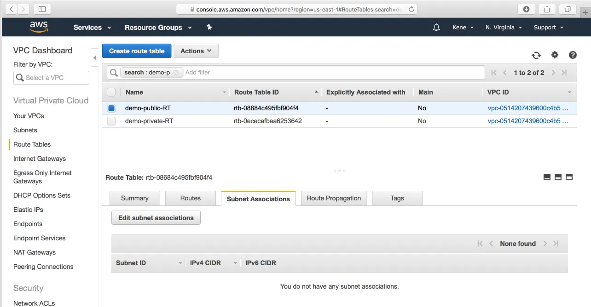
    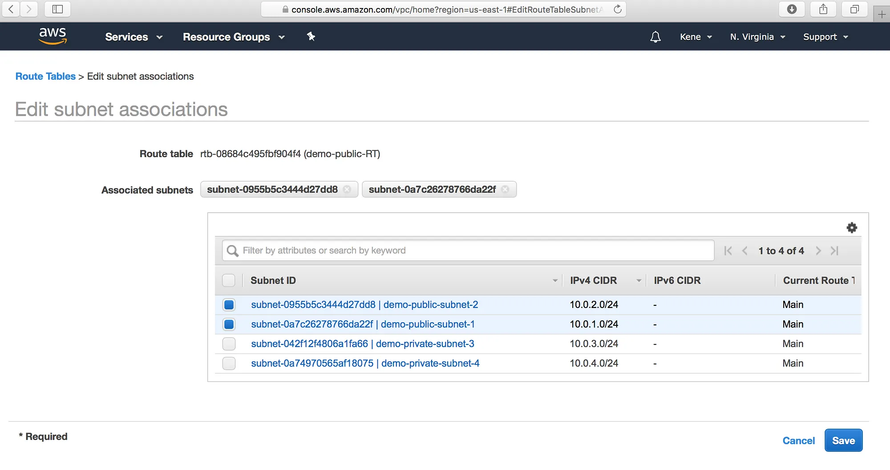
  7. We also need to route the traffic to the internet through the internet gateway for our public route table.
    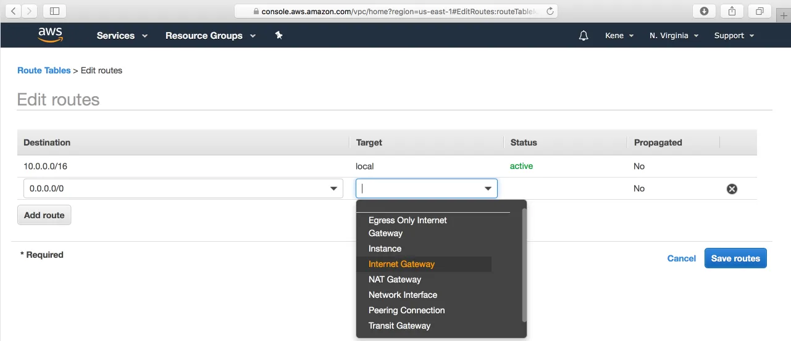
  8. Create the NAT Gateway: The NAT gateway enables the EC2 instances in the private subnet to access the internet. The NAT Gateway is an AWS managed service for the NAT instance. To create the NAT gateway, navigate to the NAT Gateways page, and then click on the Create NAT Gateway.
    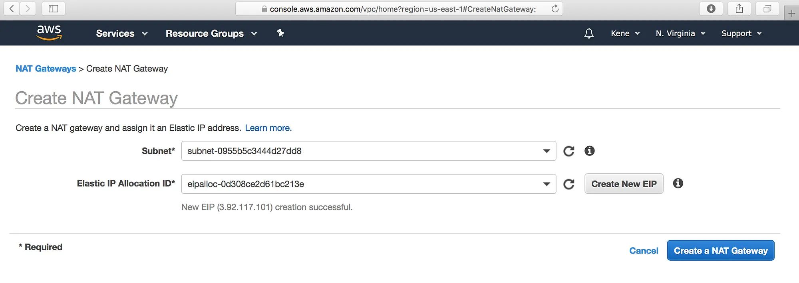
   * Now that we have the NAT gateway, we are going to edit the private route table to make use of the NAT gateway to access the internet.
    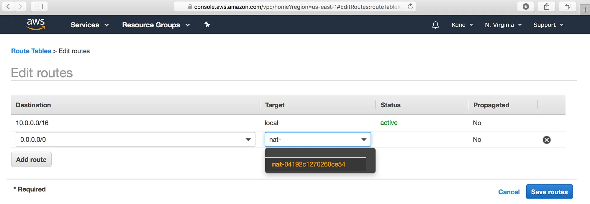
    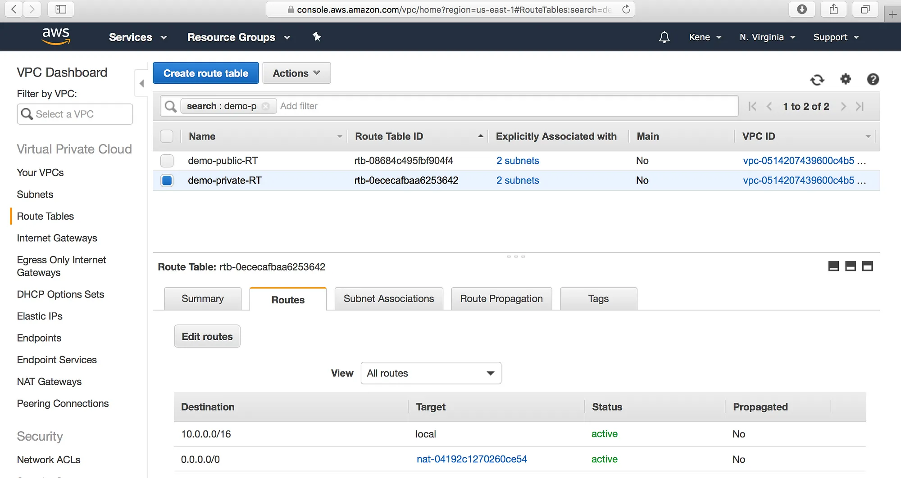
  9. Create Elastic Load Balancer: From our architecture, our frontend tier can only accept traffic from the elastic load balancer which connects directly with the internet gateway while our backend tier will receive traffic through the internal load balancer.
    * Select the Application Load Balancer.
    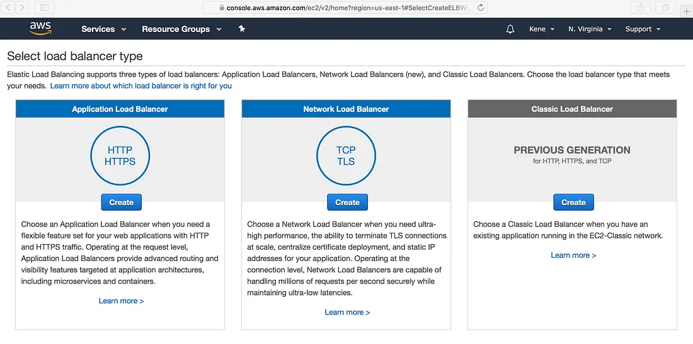
    * Click on the Create button.
    * Configure the Load Balancer with a name. Select internet facing for the load balancer that we will use to communicate with the frontend and internal for the one we will use for our backend.
     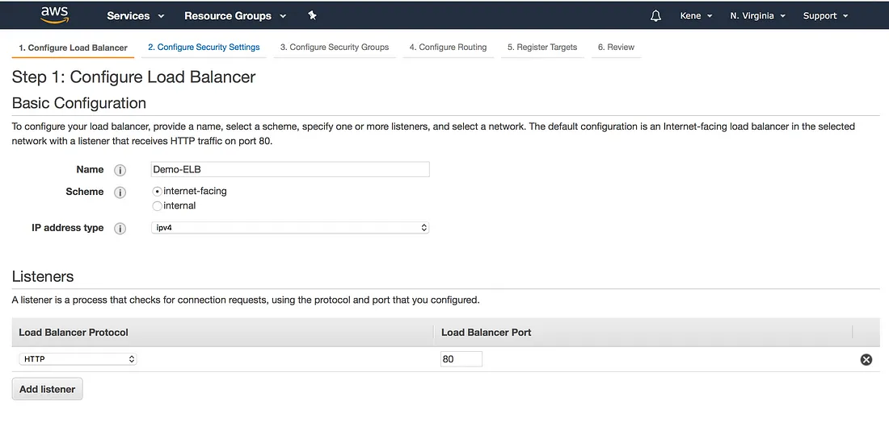
     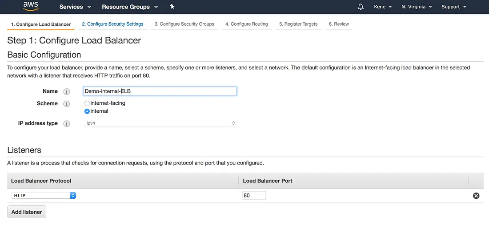
    * Under the Availability Zone, for the internet facing Load Balancer, we will select the two public subnets while for our internal Load Balancer, we will select the two private subnet.
     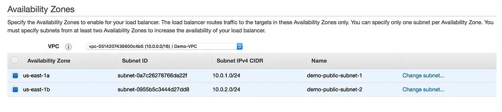
     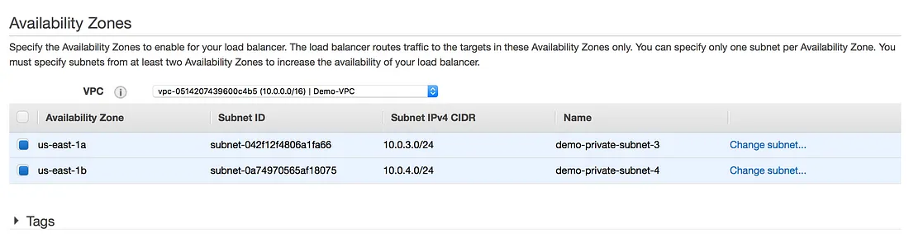
    * Under the Configure Routing, we need to configure our Target Group to have the Target type of instance. We will give the Target Group a name that will enable us to identify it. This is will be needed when we will create our Auto Scaling Group. For example, we can name the Target Group of our frontend to be Demo-Frontend-TG. Skip the Register Targets and then go ahead and review the configuration and then click on the Create button. 
  10. Auto Scaling Group: We can simply create like two EC2 instances and directly attach these EC2 instances to our load balancer. The problem with that is that our application will no longer scale to accommodate traffic or shrink when there is no traffic to save cost. With Auto Scaling Group, we can achieve this feat. Auto Scaling Group is can automatically adjust the size of the EC2 instances serving the application based on need. This is what makes it a good approach rather than directly attaching the EC2 instances to the load balancer.
  11. To create an Auto Scaling Group, navigate to the Auto Scaling Group page, Click on the Create Auto Scaling Group button.

   1. Auto Scaling Group needs to have a common configuration that instances within it MUST have. This common configuration is made possible with the help of the Launch Configuration. In our Launch configuration, under the Choose AMI, the best practice is to choose the AMI which contains the application and its dependencies bundled together. You can also create your custom AMI in AWS.
    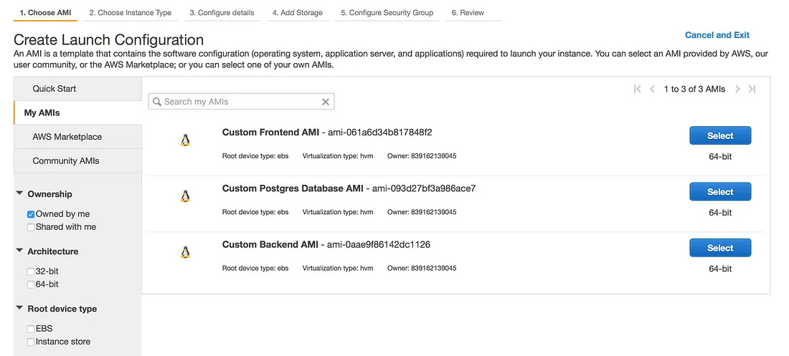
   2. Choose the appropriate instance type. For a demo, I recommend you choose t2.micro (free tier eligible) so that you do not incur charges.
   3. Under the Configure details, give the Launch Configuration a name, eg Demo-Frontend-LC. Also, under the Advance Details dropdown, the User data is provided for you to type in a command that is needed to install dependencies and start the application.
     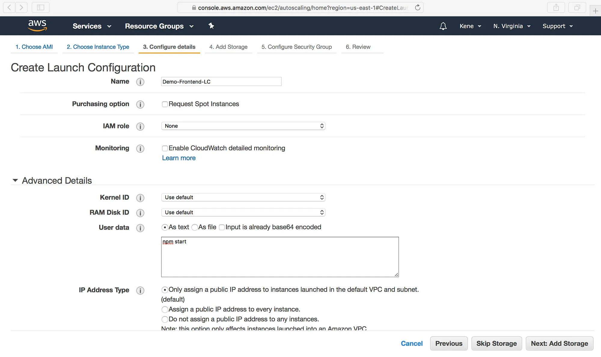
   4. Again under the security group, we want to only allow the ports that are necessary for our application.
   5. Review the Configuration and Click on Create Launch Configuration button. Go ahead and create a new key pair. Ensure you download it before proceeding.
   6. Now we have our Launch Configuration, we can finish up with the creating our Auto Scaling Group. Use the below image as a template for setting up yours.
     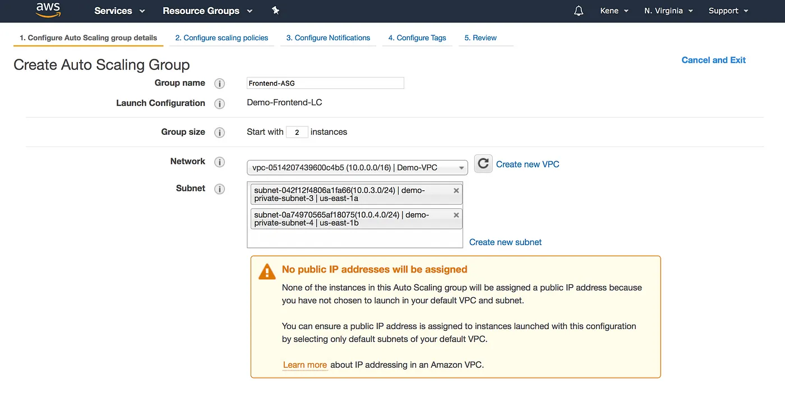
     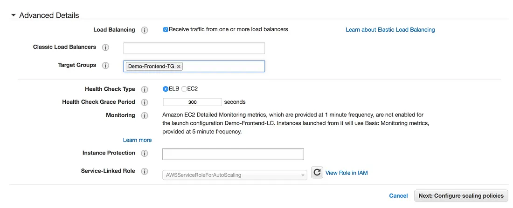
   7. Under the Configure scaling policies, we want to add one instance when the CPU is greater than or equal to 80% and to scale down when the CPU is less than or equal to 50%. Use the image as a template.
     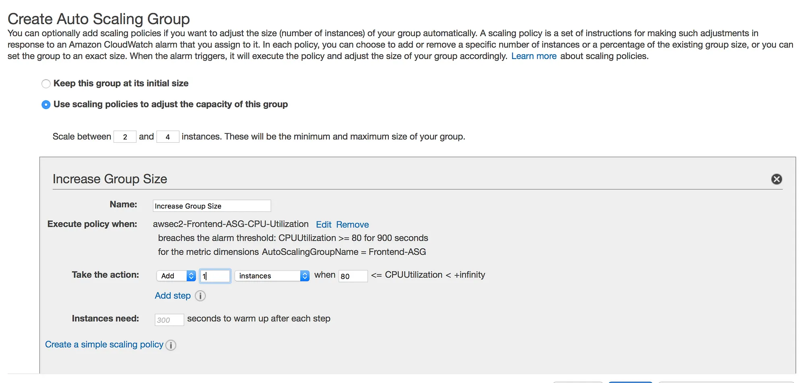
     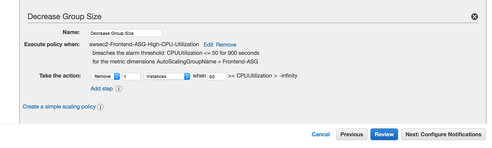
   8. We can now go straight to Review and then Click on the Create Auto Scaling group button. This process is to be done for both the frontend tier and the backend tier but not the data storage tier.
      * We have almost setup or architecture. However, we cannot SSH into the EC2 instances in the private subnet. This is because have not created our bastion host. So the last part of this article will show how to create the bastion host.
  12. Bastion Host: The bastion host is just an EC2 instance that sits in the public subnet. The best practice is to only allow SSH to this instance from your trusted IP. To create a bastion host, navigate to the EC2 instance page and create an EC2 instance in the demo-public-subnet-1 subnet within our VPC. Also, ensure that it has public IP.
     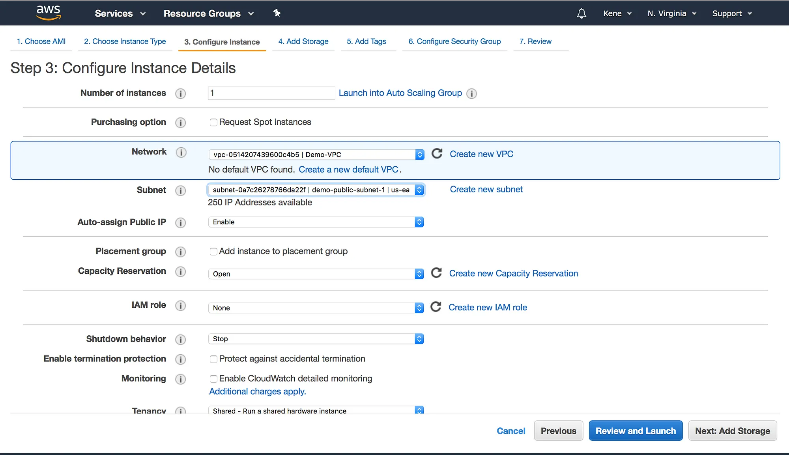
     
Conclusion: 
-----------
* There were lots of clicking and configurations when using the console to set up a three-tier architecture in AWS. 