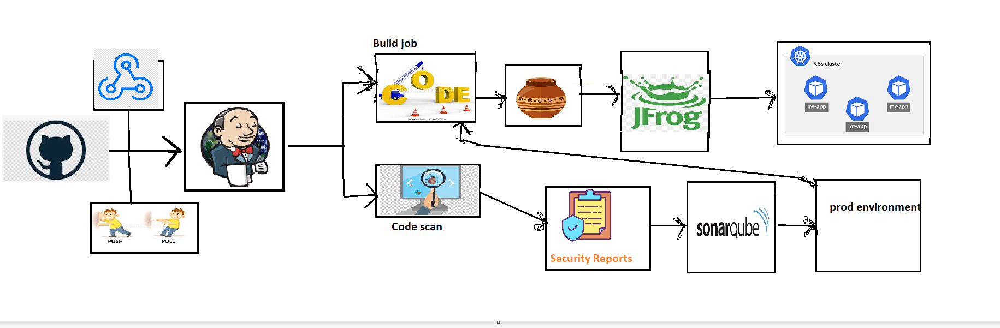

Create an architecture diagram for a Multi-branch CICD pipeline:
----------------------------------------------------------------

* For monitoring CI/CD, the ELK Stack has long been a popular open source for log analytics, and many master the art of Kibana dashboarding, so I’ll use it for the CI/CD health monitoring. Note that since 2021 Elasticsearch and Kibana are no longer open source, but you can use their open source fork OpenSearch to achieve the same with Apache2 license.
* Pipeline monitoring is handled through resource utilization.