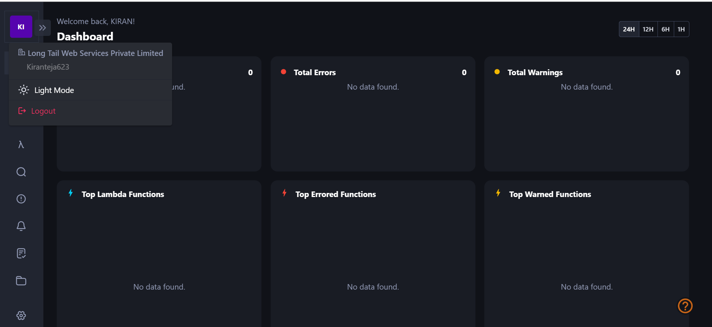

Register for KloudMate free plan and integrate your AWS account:
---------------------------------------------------------------- 
1. Create an account with KloudMate and register for the free plan.
2. Connect your AWS account to KloudMate.
   
3. Explain the benefits of using KloudMate, such as automating routine AWS tasks, providing a centralized view of all AWS resources, and reducing the risk of human error.
* KloudMate is an AWS cloud management platform that offers several benefits for automating routine AWS tasks, providing a centralized view of all AWS resources, and reducing the risk of human error. Here are the key advantages of using KloudMate:
    1. Automation of Routine AWS Tasks: KloudMate helps automate repetitive and time-consuming AWS tasks. It provides a set of pre-built automation workflows, allowing you to streamline processes such as resource provisioning, deployment, scaling, and backup. By automating these tasks, you can save time and effort, enhance efficiency, and reduce the chances of manual errors.
    2. Centralized View of AWS Resources: KloudMate provides a centralized and unified view of all your AWS resources. It offers a dashboard or user interface that consolidates information from different AWS services and presents it in a single location. This unified view enables you to monitor and manage your AWS infrastructure more effectively. You can easily track resource utilization, analyze performance metrics, and identify potential bottlenecks or issues.
    3. Risk Reduction of Human Error: Manual configuration and management of AWS resources can introduce the risk of human error, leading to misconfigurations or security vulnerabilities. KloudMate helps mitigate this risk by providing guided workflows, templates, and best practices for provisioning and managing AWS resources. 
    4. Cost Optimization and Resource Management: KloudMate offers features for cost optimization and resource management. It provides insights into resource utilization, cost breakdowns, and recommendations for optimizing AWS infrastructure. With this information, you can identify idle resources, right-size instances, and implement cost-saving measures.
    5. Collaboration and Team Management: KloudMate supports collaboration and team management by providing role-based access control (RBAC) and user management features. You can define granular permissions and access levels for different team members or departments, ensuring proper segregation of duties and reducing the risk of unauthorized access or accidental modifications.
4. Discuss the unique selling points of KloudMate, such as its intuitive interface, easy setup, and cost-effectiveness compared to other similar solutions.
   * KloudMate offers several unique selling points that set it apart from other similar solutions. Let's discuss some of these key differentiators:
   * Intuitive Interface: KloudMate prides itself on providing an intuitive and user-friendly interface. The platform is designed to be accessible to both technical and non-technical users, making it easy for teams to adopt and use. 
   * Easy Setup and Onboarding: KloudMate offers a straightforward setup and onboarding process. Getting started with KloudMate is quick and hassle-free. The platform provides clear documentation, tutorials, and step-by-step guides to help users set up their AWS accounts and establish the necessary integrations. 
   * Cost-Effectiveness: KloudMate offers cost-effectiveness compared to other similar solutions in the market. The platform provides a range of features and functionalities at competitive pricing, making it an attractive option for businesses of all sizes. KloudMate's cost optimization capabilities, such as resource utilization insights and cost-saving recommendations, help organizations optimize their AWS spending and maximize their return on investment (ROI).
   * Comprehensive Feature Set: KloudMate offers a comprehensive feature set that covers various aspects of AWS management. From resource provisioning and deployment automation to monitoring, security, and compliance, KloudMate provides a wide range of tools and functionalities. 
   * Customer Support and Continuous Improvement: KloudMate is known for its responsive customer support and commitment to continuous improvement. The platform offers timely assistance and support to its customers, addressing any queries or issues they may have.